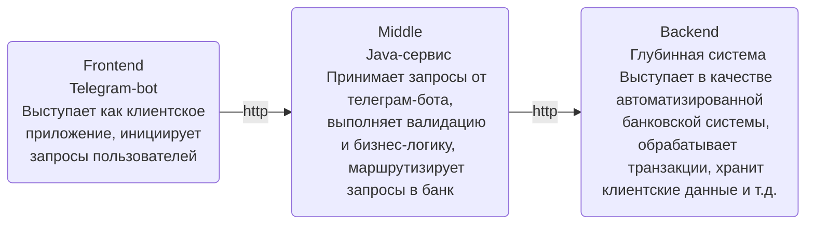
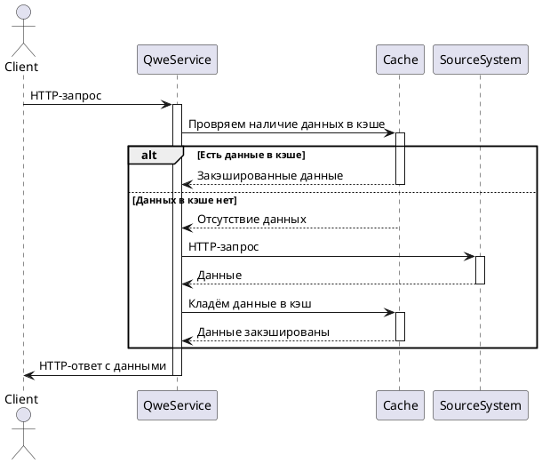

# sumkin-telegram-bot
Educational, pre-onboard sample tg Java Spring boot banking service
___

Telegram bot - одно из приложений, разрабатываемых в рамках стажировки GPB-IT-FACTORY. 
Выступает как клиентское приложение, инициирующее запросы пользователей



___
### Содержание
* [Установка](#installation)
* [Возможности](#features)
* [Технологии](#technologies)
* [Лицензия](#license)


### <a id="installation">Установка приложения</a>
___
1. Проверить версию java (требуется поддержка java 17, gradle версии 8.7):
```
java --version
```
2. Клонируйте проект по ссылке https://github.com/gpb-it-factory/sumkin-telegram-bot.git

3. В папке GbpBot\MiddleService\src\main\resources создайте файл secret.keys и  разместите
токен бота в формате "token: yourToken". Он будет использован в проекте.

4. В терминале перейдите в папку MiddleService: cd MiddleService
5. Запустите build проекта: build gradle 
6. После успешного build перейдите в папку libs: cd build/libs
7. Запустите jar файл проекта: java -jar MiddleService-0.0.1-SNAPSHOT.jar


### <a id="features">Возможности приложения</a>
___
Телеграм-бот позволяет эмулировать запросы пользователей и отправлять их в сервис основной бизнес-логики.
На текущий момент обрабатывается только 1 команда - "/ping". Бот дает на нее ответ "pong"


### <a id="technologies">Применяемые технологии</a>
___
При разработке приложения используются следующие технологии:
- java 17
- spring boot 3
- telegram bot java library 
- gradle
- ...

## TO BE
Предполагается добавить кэширование данных, схема взаимодействия будет следующей.

**Примечание преподавателя**: расширение для PlantUML не работает в версиях IDEA 2024.x.y, используйте предыдущие версии.




### <a id="license">Лицензия</a>
